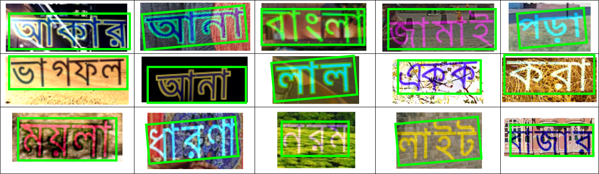

# BSTE-dataset
The revised simulated dataset and the associated files required to generate simulated data has been updated in ["Simulated Data for bangali text localisation in natural image", Sourav saha, Md Easin Arafat, Md Aminul Haque Palash, Faria Afrin, Md Dewan Farid, M Shamim Kaiser](https://data.mendeley.com/datasets/h9kry9y46s/draft?a=7bc822ec-d40d-4522-abb2-ede6822c664c)

** simulated text-localization Image Samples **

